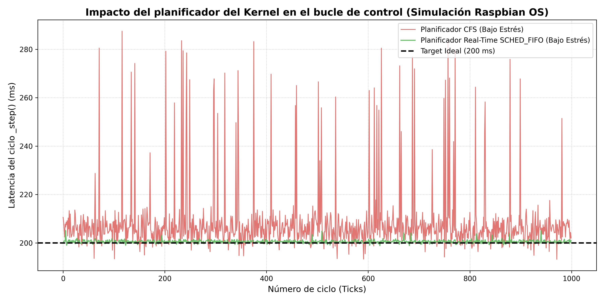

# QUPA Robot: Evaluación de planificación en tiempo real 

Este repositorio contiene el código fuente de la Prueba de Concepto (PoC) para el proyecto final de la materia **Sistemas Operativos Avanzados**, perteneciente a la Maestría en Ciencias de la Computación (ESPOL).

El objetivo principal es evaluar el rendimiento de el planificador de Linux sobre los lazos de control de la plataforma robótica QUPA, implementada en ROS 2 Jazzy.

## Estructura del Repositorio

* `/code/qupa_experiment_node.py`: Contiene el nodo de ROS 2 que ejecuta la Máquina de Estados Finitos (FSM) del robot. Este código gestiona el control que ejecuta el robot durante los experimentos. Depende de llamadas periódicas configuradas a 5.0 Hz para actualizar la cinemática y respuesta del robot en base a los sensores IR y la cámara.
* `/sim/jitter_simulator.py`: Script de modelado estocástico (Synthetic workload modeling). Dado que actualmente la investigación se encuentra en fase de validación, este script emula las penalizaciones por cambio de contexto (context-switch) a nivel de kernel utilizando distribuciones empíricas de hardware ARM.
* `/assets/`: Contiene las salidas gráficas de la prueba de concepto implemenada en el *jitter_simulator.py*.

## El Problema: Latencia de cola (Tail latency)

El planificador por defecto en distribuciones de Linux embebido (Completely fair scheduler - CFS) puede no ofrecer garantías de tiempo real. Ante ráfagas de I/O (tráfico inalámbrico, escritura de logs en la tarjeta SD), el CFS expropia los hilos críticos. 

En la literatura sobre arquitecturas robóticas distribuidas (Casini et al., 2019, *Response-Time Analysis of ROS 2 Processing Chains*), el *jitter* severo en la cadena de procesamiento de ROS 2 corrompe el determinismo del sistema. En nuestro caso de estudio en el nodo `qupa_experiment_node.py`, se cree que un retraso provoca que el callback cuando reciba datos opere sobre una serie de datos en el pasado, afectando la respuesta de los robots y el rendimiento del enjambre.

## Resultados de la Simulación

Al ejecutar el modelado sintético de la carga de trabajo, comparamos el comportamiento bajo CFS versus la implementación propuesta de aislamiento computacional mediante políticas de tiempo real (`SCHED_FIFO`).



* **Traza Roja (Planificador CFS bajo estrés):** Se evidencia un *jitter* global de 17.82 ms, con picos de latencia (*tail latency*) que empujan el percentil 99 ($P_{99}$) a los 268.10 ms. El hilo es constantemente interrumpido.
* **Traza Verde (Planificador SCHED_FIFO):** Al emular el aislamiento de CPU y priorizar el proceso crítico, la latencia de cola desaparece. El *jitter* se reduce un 95.2% (0.85 ms), garantizando la ejecución estricta del lazo de control sobre los 200 ms ideales.

## Requisitos 
Para generar los datos y la gráfica localmente:

```bash
# Instalar dependencias para el simulador
pip install numpy pandas matplotlib

# Ejecutar la simulación
python sim/jitter_simulator.py