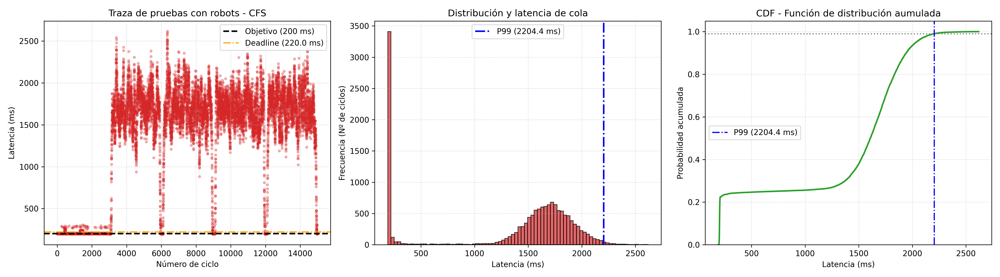

## Analisis de primeras pruebas

Se recolectaron datos en 5 pruebas realizadas con un robot físico. Estas pruebas fueron tomadas en experimentos a partir de la ejecusión del software de control (FMS) del robot, los datos fueron guardados bajo el en archivo formato ***csv***. Y cada uno contiene 3000 datos para un total de 15000 datos a analizar. A continuación se muestran los resultados.

### Diagnóstico acumulado de rendimiento

A continuación se presentan las métricas estadísticas obtenidas tras procesar **15000 ciclos** correspondiente a 5 ejecuciones de 3000 muestras cada una bajo el planificador estándar **CFS**.

| Métrica | Valor |
| :--- | :--- |
| **Total Ciclos** | 15,000 |
| **Tiempo Medio** | 1327.19 ms |
| **Jitter (Desviación)** | 673.66 ms |
| **Percentil 99 (P99)** | 2204.37 ms |
| **Percentil 99.9 (P99.9)** | 2452.40 ms |
| **Pico Máximo** | 2618.53 ms |
| **Fallos (>220 ms)** | 11,591 |
| **Tasa de Fallo** | 77.27% |

> Una tasa de fallo del **77.27%** indica que el planificador CFS no puede garantizar el determinismo temporal requerido para ejecutar el software de control en el robot del enjambre.

1. Tasa de pruebas: La tasa de fallo del 77.27%, implica que la máquina de estados finitos (FSM) del robot operó con retraso, utilizando datos de sensores retardados es decir con un delay en el pasado.

2. La gráfica de dispersión evidencia una distribución bimodal, lo que se interpreta en el grafico es lo siguiente:
* Fase nominal: Durante los primeros 3000 ciclos, el planificador logra mantener el hilo de ROS 2 en la marca de los 200 ms.
* A partir del ciclo 3000, el sistema experimenta una expropiación sostenida. La contención de recursos por iteraciones constantes de los sensores del robot, interrupciones de red y la acción de actuadores en la arquitectura de la Raspberry Pi Zero 2 W obliga al hilo de control a esperar entre 1000 ms y 2500 ms por acceso a la CPU, para poder reaccionar.

3. El histograma muestra dos frentes operativos, el primero un pico minúsculo y aislado en la zona de alrededor de los 200 ms y campana de latencia centrada alrededor de los 1600-1800 ms.

4. La función de distribución Acumulada (CDF) representa este impacto en forma probabilística. La curva se mantiene plana después del 25%, indicando que solo una cuarta parte de los ciclos se procesaron correctamente. La pendiente pronunciada posterior culmina en un Percentil 99 ($P_{99}$) de 2204.4 ms. Lo que podemos decir que estadísticamente el 1% de las veces, el robot permanece sin respuesta computacionalmente antes de emitir un comando de velocidad o respuesta.

Los datos empíricos muestra que el planificador CFS no es una opción viable para el comportamiento reactivo de la plataforma robótica. La magnitud del jitter de 673.66 ms y la tasa de fallos indican que a nivel de kernel es necesario se debe tomar acción y migrar el hilo de control quizas a una política de tiempo real de tipo SCHED FIFO, buscando garantizar la ejecución continua de los procesos durante los experimentos.